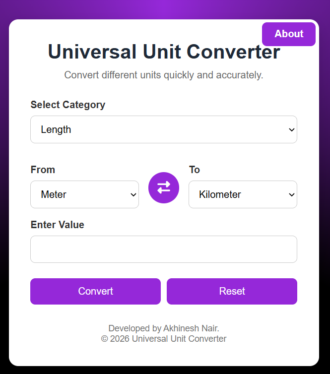
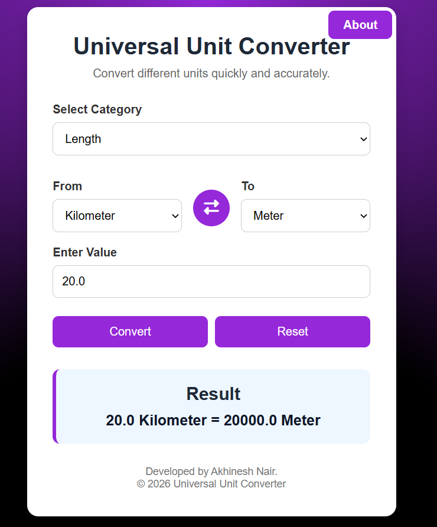
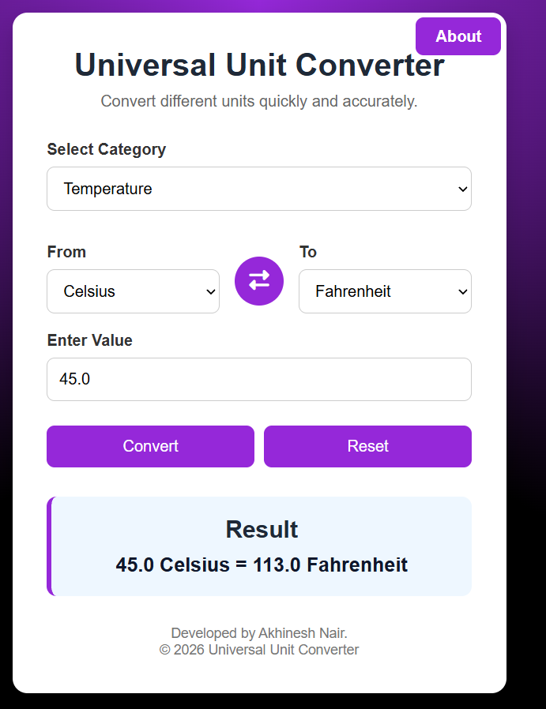
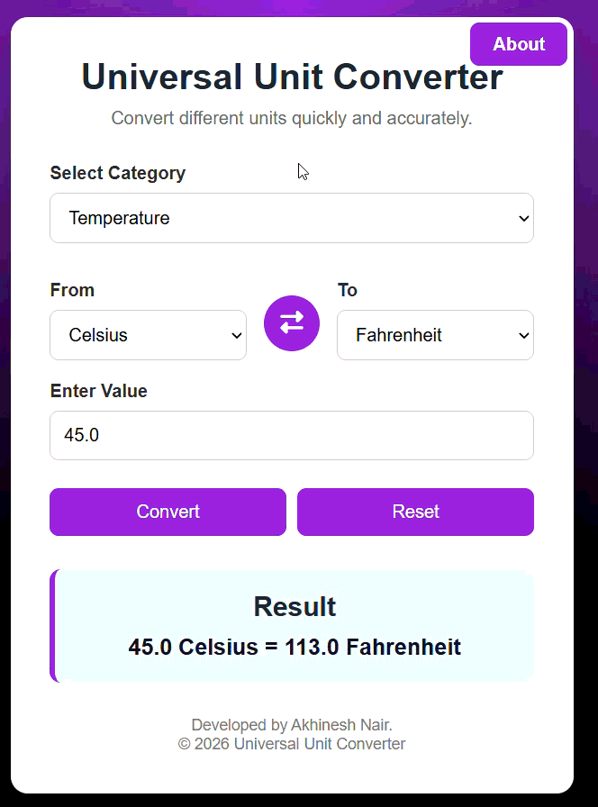

# Universal Unit Converter

## Intern Details

- **Intern ID:** CITS6205
- **Full Name:** Akhinesh Nair
- **Duration:** 4 Weeks
- **Project Name:** Universal Unit converter

---

## Project Summary

A modern and responsive web-based **Universal Unit Converter** built using **Python, Flask, HTML, CSS, and JavaScript**. The application allows users to convert values between different measurement units quickly and accurately through an intuitive web interface.

---

## Features

- Convert units across multiple categories
- Dynamic unit selection
- Swap "From" and "To" units
- Input validation
- Responsive and modern user interface
- About page
- Instant conversion results

---

## Supported Categories

- Length
- Weight
- Temperature
- Speed
- Time
- Area
- Volume

---

## Technologies Used

- Python 3
- Flask
- HTML5
- CSS3
- JavaScript

---

## Project Structure

```
Unit-Converter/
│
├── app.py
├── converter.py
├── requirements.txt
├── README.md
├── .gitignore
│
├── templates/
│   ├── index.html
│   └── about.html
│
├── static/
│   ├── style.css
│   └── scripts.js
│
└── venv/
```

---

## Installation

1. Clone the repository

```bash
git clone https://github.com/Akhinesh-Nair/Unit-Converter.git
```

2. Open the project folder

```bash
cd Unit-Converter
```

3. Create a virtual environment

```bash
python -m venv venv
```

4. Activate the virtual environment

### Windows

```bash
venv\Scripts\activate
```

### Linux/macOS

```bash
source venv/bin/activate
```

5. Install dependencies

```bash
pip install -r requirements.txt
```

---

## Running the Application

Start the Flask server:

```bash
python app.py
```

Open your browser and visit:

```
http://127.0.0.1:5000
```

---

## Live Demo

https://unit-converter-o82s.onrender.com/

---
## Screenshots

### Home psge



### Length conversion



### Temperature conversion



### Swap button demo



---

## Future Improvements

- Currency Converter
- Dark Mode
- Conversion History
- Copy Result Button
- Scientific Calculations
- API Integration

---

## Author

**Akhinesh Nair**

python Internship Project

---

